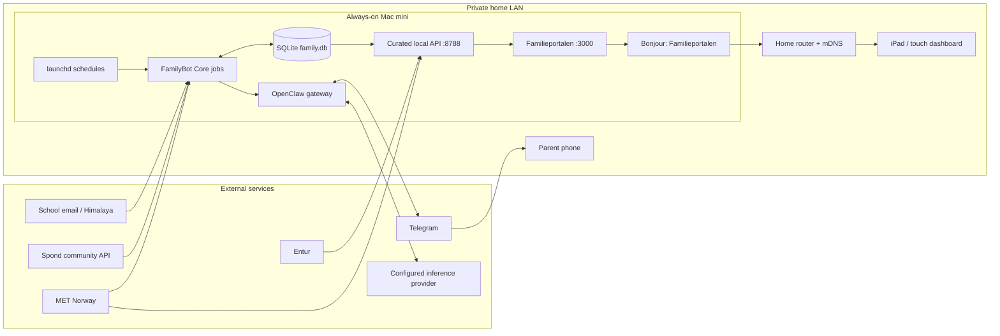
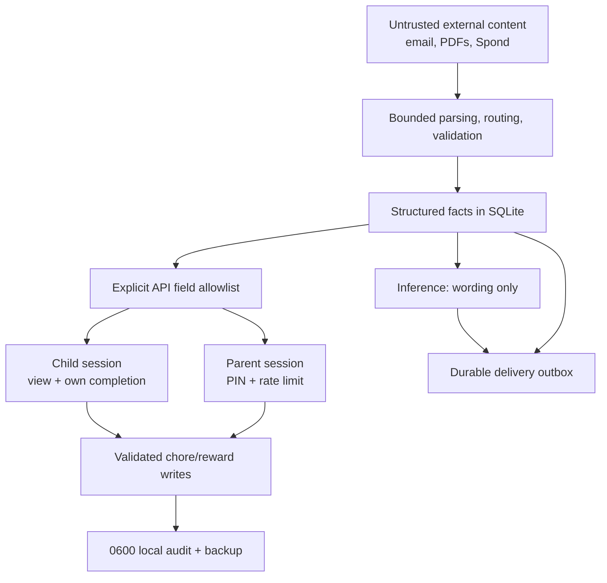

# Architecture

FamilyBot is a local-first Norwegian family information service. Deterministic
jobs collect and store facts; optional inference improves wording; the iPad
dashboard and Telegram expose curated views.

## Physical topology



The browser is a family appliance, not an OpenClaw administration console. It
cannot read raw email, credentials, raw Spond payloads or arbitrary files, and
it cannot trigger scheduled ingestion or Telegram delivery.

## Data and trust boundaries



Inference is outside the durability boundary. If it fails, deterministic
briefings, ingestion state, retries and dashboard data remain available.

## Runtime layout

```text
Git checkouts/                         reviewed, non-private source
  familybot-core/
  familybot-portal/

$HOME/.openclaw/workspace/            private durable state
  config/family.local.json
  db/family.db
  scripts/
  secrets.env
  attachments/, logs/, memory/, backups/

$HOME/.openclaw/runtime/familybot-portal/  generated deployed portal
$HOME/Library/LaunchAgents/                reviewed schedules/supervisors
```

Source control is not a household backup. See [REDEPLOY.md](REDEPLOY.md) for
the source/state/credential restore order and [SECURITY.md](SECURITY.md) for
the threat model.
