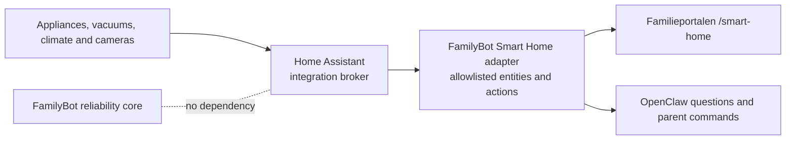

# Smart Home add-on specification

Status: **planned, not deployed**. This document records the product boundary,
researched integration paths and acceptance gate. It must not be interpreted as
proof that any appliance is currently connected.

## Product decision

Smart Home is a separate page in Familieportalen. The family home screen remains
calm and shows only actionable summaries such as a freezer door warning,
finished laundry or low cabin temperature. Device details, controls and cameras
belong on `/smart-home`.

Home Assistant is the planned appliance broker. FamilyBot should integrate once
with Home Assistant's curated local API rather than embedding every vendor's
credentials, polling rules and protocol directly in core.

## Site topology

The always-on Mac mini is at home. Devices at the second location are not on its
LAN. A cloud-capable integration can expose cabin state through Home Assistant,
but truly local cabin control requires a small cabin-side Home Assistant or
ESPHome node connected through a reviewed VPN.

If the internet fails, home-local devices should remain usable. Cabin/cloud
cards should become explicitly unavailable rather than showing old state as
current.

## Researched household device inventory

Exact models are deployment inputs, not hard-coded application constants.

| Device | Location/current app state | Preferred path | Locality and confidence |
| --- | --- | --- | --- |
| Roborock S5 | Home; Xiaomi Home; powered off during first LAN discovery | Home Assistant Xiaomi Miio | Local LAN polling/control after Xiaomi authorization/token; high confidence |
| Roborock Q5 Pro (`roborock.vacuum.a72`) | Cabin; same Xiaomi Home account | First test Xiaomi's Home Assistant cloud integration without re-pairing; use local MiIO only from a later cabin node | Cloud from home; local only with cabin node; exact entities must be verified |
| AEG 9000-series TR944P95P, PNC 916099978 | Wi-Fi not currently enabled | Electrolux developer API through reviewed Home Assistant community integration | Cloud-only and exact model not yet verified; leave disconnected initially |
| Grundig GWN69P430 | Wi-Fi not currently enabled; HomeWhiz supports Wi-Fi and Bluetooth | HomeWhiz Bluetooth through an ESPHome proxy near the washer | Potentially local after initial mapping; one active Bluetooth client limitation |
| Samsung freezer | Exact model not yet recorded | SmartThings if the model exposes useful capabilities | Cloud; door/temperature/energy model-dependent |
| Nest cabin camera | Exact model not yet recorded | Official Home Assistant Nest integration | Cloud authorization; parent-only camera page |
| Toshiba cabin heat pump | Exact indoor unit/Wi-Fi module not yet recorded | Community cloud adapter initially; model-specific ESPHome only after hardware review | Cloud by default; local modification is a separate cabin project |

HelloFresh/menu data is household information, not Smart Home device control,
and belongs in a separate optional information adapter.

## Xiaomi first slice

The first integration target is the two Roborock vacuums because the S5 offers
the clearest local-control proof.

1. Install Home Assistant OS in a supported VM on the Mac mini with bridged
   networking, automatic start and protected backups.
2. Keep both vacuums in Xiaomi Home. Do not reset Wi-Fi, migrate apps or disturb
   saved maps for discovery.
3. Power on the home S5, discover it read-only, reserve its address and authorize
   Xiaomi locally through Home Assistant.
4. Verify S5 state before enabling Start, Pause or Dock actions.
5. Test whether Xiaomi's Home Assistant integration exposes the Q5 Pro through
   the same account. The home-side MiIO adapter cannot directly reach a cabin
   LAN address. Label the device `Cloud` until a cabin-local broker exists.
6. Do not migrate the Q5 Pro to the Roborock app unless the Xiaomi path is proven
   inadequate and map/re-pairing impact is explicitly accepted.

## Portal information architecture

- Overview: Home/Cabin connectivity and important alerts.
- Cleaning: state, battery, current task, Start, Pause and Dock.
- Climate: measured/target cabin temperature and operating mode.
- Laundry and kitchen: cycle, remaining time, finished state, maintenance and
  door/temperature warnings.
- Cameras: separate parent-only Nest surface.
- History: meaningful state changes and an audit of commands.

Every tile displays one of `Local`, `Cloud`, `Experimental`, `Stale` or
`Offline`. Marketing terms such as “real-time” are used only when freshness is
measured and displayed.

## Control policy

- Family/child view may see benign state and completion notifications.
- Parent authorization is required for cameras, temperature changes and device
  commands unless a command is deliberately classified as safe.
- Washer/dryer remote start begins disabled even when a vendor exposes it.
- Read-only onboarding precedes control onboarding for every device.
- Consequential actions require confirmation, idempotency and an audit record.
- Vendor passwords and tokens stay in Home Assistant or an owner-only secret
  store. The portal receives only normalized state and narrow actions.

## Configuration boundary

The public template should eventually define generic device aliases, location,
visibility, provider entity IDs and control policy. The populated inventory and
entity IDs live only in `family.local.json` or a separate owner-only Smart Home
file. Home Assistant credentials never belong in that metadata file.

The FamilyBot adapter uses a dedicated non-admin Home Assistant user/token where
possible. It must allowlist entities and actions; it must not proxy arbitrary
Home Assistant service calls from the browser.

## Xiaomi acceptance criteria

The Xiaomi slice is complete only when all criteria pass:

1. The S5 is discovered without reset/re-pairing or loss of its saved map.
2. Dashboard state includes site, connectivity class, battery, dock/cleaning
   state and a measured freshness timestamp.
3. Start, Pause and Dock work through a parent-authorized allowlist and are
   idempotent against repeated taps.
4. Loss of Xiaomi cloud does not falsely report a local command as successful.
5. An offline or powered-off vacuum becomes unavailable without breaking the
   family dashboard.
6. The cabin Q5 Pro is visibly labelled Cloud until a cabin-local broker exists.
7. No Xiaomi credential, token, map payload or precise location appears in Git,
   browser responses, shared logs or OpenClaw prompts.
8. Smart Home failure has no effect on email ingestion, `ukeplan`, briefing
   generation, delivery outbox, Telegram or the base dashboard.
9. Provider, API authorization, negative-origin and responsive iPad tests pass.
10. Disable/rollback removes the add-on without a core database rollback.

## Authentication material expected later

- Xiaomi Home authorization/server region during Home Assistant setup.
- Home Assistant service account and locally stored token for FamilyBot.
- Optional later provider credentials for Nest, SmartThings, Electrolux,
  HomeWhiz or Toshiba.

Credentials must be entered into the provider's local setup flow, not chat or
Git. Test the granted capability, never by printing a token.

## Primary references

- [Home Assistant Xiaomi Miio](https://www.home-assistant.io/integrations/xiaomi_miio/)
- [Xiaomi Home integration maintained by Xiaomi](https://github.com/XiaoMi/ha_xiaomi_home)
- [Home Assistant Roborock](https://www.home-assistant.io/integrations/roborock)
- [Home Assistant macOS installation](https://www.home-assistant.io/installation/macos/)
- [HomeWhiz Home Assistant integration](https://github.com/home-assistant-HomeWhiz/home-assistant-HomeWhiz)
- [Electrolux Home Assistant integration](https://github.com/TTLucian/ha-electrolux)
- [Home Assistant Nest](https://www.home-assistant.io/integrations/nest)
- [Home Assistant SmartThings](https://www.home-assistant.io/integrations/smartthings)
